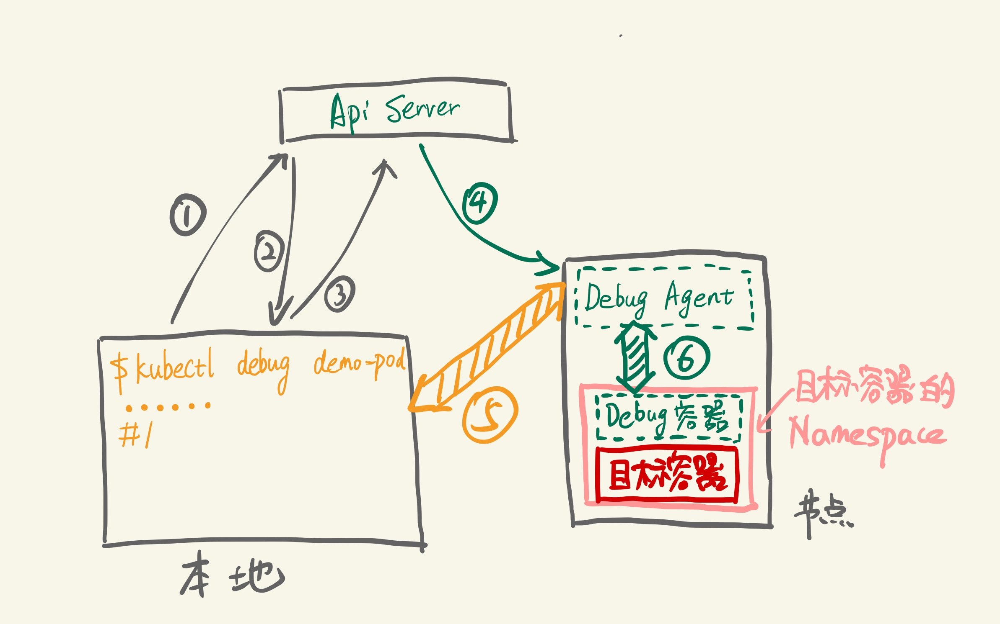

# 容器调试与排障

## 概述

对于容器而言, 我们通常希望构建的容器镜像尽可能精简以节省资源, 提高容器部署效率, 同时尽可能保证安全性, 事实上公共容器镜像仓库中发布的base镜像大多都是精简的.

无论是自构建的精简镜像还是基于精简镜像构建的其他镜像, 都意味着大量常用工具的缺失, 都为容器的测试调试和故障排除带来很大的不便. 仅仅依靠nsenter, docker-cli及容器日志往往是不够的, 而为了调试和故障诊断去构建工具齐全的业务容器又得不偿失...

对于Kubernetes环境而言, kubectl工具能够部分代替docker-cli且在容器层面之上可展示详细的资源和事件信息, 但对于容器本身的调试和排障依然面临同样的尴尬. 

Kubernetes社区早已意识到此问题也有相应的proposal, 目前已存在一些官方和非官方解决方案, 本文将详细介绍这些方案是如何实现容器调试和诊断的.

## 原理工具

在业务镜像中内置大量调试排障工具显然是不明智的, 这不仅会导致镜像臃肿, 也会带来潜在的安全隐患, 因此较为可行的方案是借助功能齐全的工具容器对各个目标业务容器进行调试诊断.

### 原理

容器本质上是宿主机上带有cgroup资源限制和namespace隔离的一组进程, 因此只要启动一个进程, 并让该进程加入到目标容器的各namespace中, 这个进程就能够"进入容器内部", 与容器中的进程"看到"相同的文件系统, 虚拟网卡, 进程空间等资源(这也正是docker exec和kubectl exec的运行方式).

> 容器文件系统通过/proc/$pid/root链接对pod中的其他容器可见

docker本身是支持通过命令行参数实现容器之间各命名空间的共享的, 因此只要启动一个工具齐全的容器并让该容器共享业务容器的命名空间, 就能够利用工具容器中丰富的工具对业务容器进行调试诊断了. 命令如下:

```bash
# busybox容器共享了目标容器的网络命名空间, PID命名空间和IPC命名空间
docker run -it --network=container:$TARGET_ID --pid=container:$TARGET_ID --ipc=container:$TARGET_ID busybox
```

### 工具

如何生成一个功能齐全的工具镜像呢, github上有一个开源项目[nicolaka/netshoot](https://github.com/nicolaka/netshoot), 该项目包含大量网络相关的诊断调试工具:


基于该项目, 我们对其工具集进行了扩充并进行了部分定制, 额外提供了如下工具:
- ctop: 类似与top命令的开源容器指标实时监测工具
- htop: 增强的top工具
- docker: 容器内的docker
- calicoctl: calico网络命令行
- kubectl: Kubernetes命令行
- ipfs: 星际文件系统
- gofs: 文件上传下载服务器
- websocketd: 命令行输出转websocket服务器
- websocat: websocket调试工具
- jq: 命令行json处理工具
- yq: 命令行yaml处理工具
- logview: 更友好的日志显示工具
- etcd: etcd分布式存储与etcdctl
- fio: 硬盘性能检测工具
- git: 分布式代码管理工具
- mysql-client: mysql数据库客户端
- postgresql-client: postgresql数据库客户端
- redis: redis键值数据库与客户端
- minio: minio对象存储
- sqlite: sqlite数据库与客户端
- nginx: nginx web服务器
- samba: samba服务器与客户端
- python3: python3
- openssh: ssh服务
- 其他如tree, sshpass, httpie, bat, exa, zsh等工具

工具镜像名为xo, Dockfile构建文件如下:

```Dockerfile
FROM alpine:latest

MAINTAINER xshrim "xshrim@yeah.net"

RUN set -ex \
    && echo "http://nl.alpinelinux.org/alpine/edge/main" >> /etc/apk/repositories \
    && echo "http://nl.alpinelinux.org/alpine/edge/testing" >> /etc/apk/repositories \
    && echo "http://nl.alpinelinux.org/alpine/edge/community" >> /etc/apk/repositories \
    && sed -i 's/dl-cdn.alpinelinux.org/mirrors.ustc.edu.cn/g' /etc/apk/repositories \
    && sed -i 's/nl.alpinelinux.org/mirrors.ustc.edu.cn/g' /etc/apk/repositories \
    && apk update \
    && apk upgrade \
    && apk add --no-cache \
    apache2-utils \
    bash \
    bat \
    bind-tools \
    bird \
    bridge-utils \
    busybox-extras \
    conntrack-tools \
    curl \
    docker \
    dhcping \
    drill \
    etcd \
    etcd-ctl \
    ethtool \
    exa \
    expect \
    file\
    figlet \
    fio \
    fping \
    git \
    httpie \
    htop \
    iftop \
    iperf \
    iproute2 \
    ipset \
    iptables \
    iptraf-ng \
    iputils \
    ipvsadm \
    libc6-compat \
    liboping \
    mtr \
    mysql-client \
    net-snmp-tools \
    netcat-openbsd \
    nftables \
    nfs-utils \
    nginx \
    ngrep \
    nmap \
    nmap-nping \
    openssl \
    openssh \
    openssh-client \
    redis \
    sshpass \
    py-crypto \
    python3 \
    postgresql-client \
    tree \
    samba \
    scapy \
    socat \
    sqlite \
    strace \
    tcpdump \
    tcptraceroute \
    util-linux \
    vim \
    zsh

RUN mv /usr/sbin/tcpdump /usr/bin/tcpdump && echo 'alias python="python3"' >> /etc/profile && sed -i 's^/bin/ash^/bin/zsh^g' /etc/passwd

# Settings
ADD tools/* /usr/bin/
COPY oh-my-zsh /root/.oh-my-zsh
COPY zshrc /root/.zshrc
COPY vimrc /root/.vimrc

CMD ["/bin/zsh","-l"]
```

## 解决方案

以下将介绍几种可行的容器调试与排障解决方案, 这些解决方案都是基于Kubernetes环境的(纯docker环境使用上文的docker命令即可), 均需使用工具镜像(可选netshoot[200MB]或我们自己构建的xo[900MB]).

### sidecar

#### 简介

Kubernetes中的业务单元是pod, pod中可以包含多个容器, 多个容器共享网络, PID和IPC命名空间, PID命名空间共享需要显式启用. **sidecar**方式即是在业务pod中同时包含业务容器和工具容器(当然sidecar的应用不止如此), 此方式使用简单, 但工具容器注入时pod内的容器将重新部署, 即容器无法在运行时注入. 

#### 示例

```yaml
apiVersion: v1
kind: Pod
metadata:
  name: nginx
spec:
  shareProcessNamespace: true
  containers:
  - name: nginx
    image: nginx
  - name: tool
    image: xo
    securityContext:
      capabilities:
        add:
        - SYS_PTRACE
    stdin: true
    tty: true
```

### kubectl-debug

#### 简介

**[kubectl-debug](https://github.com/aylei/kubectl-debug)**是由PingCAP员工开发的Kubernetes容器调试诊断插件. 本地执行kubectl-debug会在目标容器所在节点部署Debug Agent, 通过Debug Agent部署共享目标容器命名空间的工具(debug)容器(docker原生特性). kubectl-debug使用的工具默认是netshoot, 但可以配置为其他容器. 此方案是非侵入式的, 不会对目标容器产生影响. 本插件支持CrashLoopBackoff诊断.

>  **kubectl插件**
>
> kubectl插件其实是任意带`kubectl-`前缀的可执行文件, 比如`kubectl-debug`可执行文件放在`/usr/local/bin`目录下kubectl就能自动识别, 输入`kubectl debug`命令就相当于执行`kubectl-debug`命令. 通过`kubectl plugin list`命令可以查看当前kubectl插件列表.
>
> kubectl有一个名为krew的特殊插件, 它是kubectl的插件管理工具, 通过它可以下载, 检索和管理其他kubectl插件.
>
> 当前已经有许多开源的kubectl插件, 关于容器调试方面的插件除了`kubectl-debug`外, 比较知名的还有`ksniff`, 该工具主要用于tcpdump抓包.

其架构如下:

具体步骤如下:

1. 插件查询ApiServer：demo-pod是否存在, 当前运行在哪个节点
2. ApiServer返回 demo-pod所在节点
3. 插件请求在目标节点上创建Debug Agent Pod
4. Kubelet创建Debug Agent Pod
5. 插件发现Debug Agent已经Ready, 发起debug请求长连接
6. Debug Agent收到debug请求, 创建Debug容器并加入目标容器的各个Namespace中, 然后与Debug容器tty建立连接

此后客户端就可以开始通过5, 6这两个连接开始debug操作. 操作结束后Debug Agent清理Debug 容器, 插件清理Debug Agent, 一次Debug完成.

> **本地插件到Debug Agent的长连接有超时设置, 超时后Debug Agent pod会被删除, 但生成的Debug容器不会删除**
> **云昊平台环境中需使用port-forward模式**

本插件所需的Debug Agent也可以预先以DaemonSet模式在Kubernetes集群各节点中运行(支持helm chart), 以加快后续调试操作.

#### 示例

```bash
# kubectl 1.12.0 或更高的版本, 可以直接使用:
kubectl debug -h
# 假如安装了 debug-agent 的 daemonset, 可以使用 --agentless=false 来加快启动速度
# 之后的命令里会使用默认的agentless模式
kubectl debug POD_NAME

# 假如 Pod 处于 CrashLookBackoff 状态无法连接, 可以复制一个完全相同的 Pod 来进行诊断
kubectl debug POD_NAME --fork

# 当使用fork mode时,如果需要复制出来的pod保留原pod的labels,可以使用 --fork-pod-retain-labels 参数进行设置(注意逗号分隔,且不允许空格)
# 示例如下
# 若不设置,该参数默认为空(既不保留原pod的任何labels,fork出来的新pod的labels为空)
kubectl debug POD_NAME --fork --fork-pod-retain-labels=<labelKeyA>,<labelKeyB>,<labelKeyC>

# 为了使 没有公网 IP 或无法直接访问(防火墙等原因)的 NODE 能够访问, 默认开启 port-forward 模式
# 如果不需要开启port-forward模式, 可以使用 --port-forward=false 来关闭
kubectl debug POD_NAME --port-forward=false --agentless=false --daemonset-ns=kube-system --daemonset-name=debug-agent

# 老版本的 kubectl 无法自动发现插件, 需要直接调用 binary
kubectl-debug POD_NAME

# 使用私有仓库镜像,并设置私有仓库使用的kubernetes secret
# secret data原文请设置为 {Username: <username>, Password: <password>}
# 默认secret_name为kubectl-debug-registry-secret,默认namspace为default
kubectl-debug POD_NAME --image calmkart/netshoot:latest --registry-secret-name <k8s_secret_name> --registry-secret-namespace <namespace>

# 在默认的agentless模式中,你可以设置agent pod的resource资源限制,如下示例
# 若不设置,默认为空
kubectl-debug POD_NAME --agent-pod-cpu-requests=250m --agent-pod-cpu-limits=500m --agent-pod-memory-requests=200Mi --agent-pod-memory-limits=500Mi
```

### kude

#### 介绍

**kude**是我们根据kubectl-debug的原理实现的一个简易版的Kubernetes容器调试诊断工具(shell脚本), 默认使用xo作为工具容器. 本工具对目标容器同样是非侵入式的, 通过kubectl向ApiServer查询相关信息, 然后利用ssh通过分配tty在目标节点部署Debug容器(与目标容器共享各Namespace), 并进入Debug容器交互模式. 

本工具在具有kubectl的主机上即可使用, 需要提供目标节点的ssh登录账号和密码(或者提前在本地配置免密登录). 工具中部分默认值与云昊平台当前主机环境契合, 配合内网教程甚至可以直接在办公电脑上进行远程调试和诊断.

> 将本工具命名为`kubectl-kude`并保存到`/usr/local/bin/`目录下, 也能够作为kubectl插件通过`kubectl kude`命令调用.

脚本内容:

```bash
#!/usr/bin/sh

kubecfg=$HOME/.kube/config
image=xo
port=16022
timeout=60
user=root
idx=0
context=""
chroot=""
vol=""

mandatory=()

function usage() {
echo "USAGE:
  kude [<options>] podname

OPTIONS:
  -c [test] kubernetes连接上下文(可选)
  -d [log, logf, inspect, describe, wide, yaml, json] 非交互式指令(可选)
  -f [./kube/config] kubeonfig文件路径(可选)
  -i [0] 匹配pod内容器index(可选)
  -m [xo] 自定义工具容器(可选)
  -n [default] 查询的kubernetes命名空间(可选)
  -o [xos] podname模糊匹配(可选)
  -p [16022] 目标主机ssh端口(可选)
  -s [admin123] 目标主机ssh密码(可选)
  -t [60] 目标主机ssh连接超时时间(可选)
  -u [root] 目标主机ssh账号(可选)
  -r Debug容器中是否需要chroot到目标容器的文件系统
  -v Debug容器中是否需要挂载目标主机的docker.sock文件
  -h 使用说明

EXAMPLES:
# 命令在带kubectl的主机运行
# 不带ssh相关参数的命令默认已经配置了免密登录

# 最简, 所有命名空间中寻找名称带xos字段的pod, 部署Debug容器共享该pod下第一个容器的命名空间并进入交互模式
kude xos

# xshrim命名空间中寻找名称带xos字段的pod, 部署Debug容器共享该pod下第一个容器的命名空间并进入交互模式
kude -n xshrin xos

# xshrim命名空间中寻找名称带xos字段的pod, 部署Debug容器共享该pod下第一个容器的命名空间进入交互模式并chroot到该容器的文件系统
kude -n xshrim -i 0 -r xos

# 所有命名空间中寻找名称带xos字段的pod下的第二个容器并显示容器日志
kude -d log -i 1 xos

# 所有命名空间中寻找名称带xos字段的pod并显示其描述信息
kude -d describe xos

# 所有命名空间中寻找名称带xos字段的pod并将其配置以json格式输出
kude -d json xos

# xshrim命名空间中寻找名称带xos字段的pod, 部署Debug容器共享该pod下第一个容器的命名空间并进入交互模式, 目标主机ssh账号密码端口指定, Debug容器使用netshoot
kude -n xshrim -u root -p 22 -s admin123 -m netshoot xos
"
}

while [ $# -gt 0 ] && [ "$1" != "--" ]; do
  while getopts "c:d:f:i:m:n:o:p:s:t:u:hrv" opt; do
    case $opt in
      c) 
        context="--context $OPTARG"
        ;;
      d) 
        darg=$OPTARG
        image=""
        ;;
      f) 
        kubeconfig=$OPTARG
        ;;
      i)
        idx=$OPTARG
        ;;
      m) 
        image=$OPTARG
        ;;
      n) 
        namespace=$OPTARG
        ;;
      o) 
        pod=$OPTARG
        ;;
      p) 
        port=$OPTARG
        ;;
      s) 
        passwd=$OPTARG
        ;;
      t) 
        timeout=$OPTARG
        ;;
      u) 
        user=$OPTARG
        ;;
      r)
        chroot="-c 'chroot /proc/1/root/'"
        ;;
      v)
        vol="-v /var/run/docker.sock:/var/run/docker.sock"
        ;;
      h)
        usage
        exit 0
        ;;
      \?) 
        echo "Invalid option: -$OPTARG" >&2; 
        exit 1
        ;;
    esac
  done
  shift $((OPTIND-1))

  while [ $# -gt 0 ] && ! [[ "$1" =~ ^- ]]; do
    mandatory=("${mandatory[@]}" "$1")
    shift
  done
done

if [ "$1" == "--" ]; then
  shift
  mandatory=("${mandatory[@]}" "$@")
fi

if [ -z "$pod" ] && [ ${#mandatory[@]} -gt 0 ];
then
  pod=${mandatory[0]}
fi

if [ -n "$kubecfg" ] && [ -f "$HOME/.kube/config" ];
then
  kubecfg=$HOME/.kube/config
fi

if ! type docker &>/dev/null || ! type kubectl &>/dev/null;
then
  echo "docker and kubectl required"
  exit 1
fi

if [ -z "$namespace" ];
then
  ns="--all-namespaces"
else
  ns="-n $namespace"
fi

kc=""
if [ -n "$kubecfg" ];
then
  kc="--kubeconfig $kubecfg"
fi

pods=$(kubectl $kc $context get pod $ns 2>/dev/null | grep $pod)
if [ $? -ne 0 ] || [ ${#pods[@]} -eq 0 ] ;
then 
  echo "No resources found"
  exit 1
fi

if [ ${#pods[@]} -eq 1 ];
then
  podname=$(echo $pods | awk '{print $2}')
  namespace=$(echo $pods | awk '{print $1}')
  ns="-n $namespace"
else
  echo "Warning: more than one pod! selected the first one."
  podname=$(echo $pods[0] | awk '{print $2}')
  namespace=$(echo $pods[0] | awk '{print $1}')
  ns="-n $namespace"
fi

podinfo=$(kubectl $kc $context get pod $podname $ns -o=custom-columns=NODE:.spec.nodeName,HOST:.status.hostIP,NAME:.metadata.name,ADDR:.status.podIP,ID:.status.containerStatuses[$idx].containerID 2>/dev/null | grep $podname)

if [ $? -ne 0 ];
then
  echo "$podname[$idx] container not found"
  exit 1
fi

hname=$(echo $podinfo | awk '{print $1}')
haddr=$(echo $podinfo | awk '{print $2}')
cname=$(echo $podinfo | awk '{print $3}')
caddr=$(echo $podinfo | awk '{print $4}')
cid=$(echo $podinfo | awk '{print $5}')
cid=${cid#*docker://}
cid=${cid:0:12}

echo "====================================================================================================================================="
echo "Namespace: "$ns "HostName: "$hname "HostAddr:"$haddr "PodName:"$cname "PodAddr:"$caddr "containerID:"$cid
echo "====================================================================================================================================="

if [ -z "$image" ];
then
  if [ $darg == "log" ];
  then
    cmd="docker logs $cid"
  elif [ $darg == "logf" ];
  then
    cmd="docker logs -f $cid"
  elif [ $darg == "inspect" ];
  then
    cmd="docker inspect $cid"
  elif [ $darg == "describe" ];
  then
    kubectl $kc $context describe pod $podname $ns
    exit 0
  elif [ $darg == "wide" ];
  then
    kubectl $kc $context get pod $podname $ns -o wide
    exit 0
  elif [ $darg == "yaml" ];
  then
    kubectl $kc $context get pod $podname $ns -o yaml
    exit 0
  elif [ $darg == "json" ];
  then
    kubectl $kc $context get pod $podname $ns -o json
    exit 0
  fi
else
  if [ $image == "xo" ];
  then
    imgsh="$image zsh $chroot"
  else
    imgsh="$image sh $chroot"
  fi

  cmd="docker run --rm -it $vol --network=container:$cid --pid=container:$cid --ipc=container:$cid $imgsh"
fi

if [ -n "$passwd" ] && type sshpass &>/dev/null;
then
  echo $passwd
  sshpass -p $passwd ssh -t -p $port -o StrictHostKeyChecking=no -o ConnectTimeout=$timeout $user@$haddr "$cmd"
else
  ssh -t -p $port -o StrictHostKeyChecking=no -o ConnectTimeout=$timeout $user@$haddr "$cmd"
fi

```

#### 示例

```bash

kude -h
USAGE:
  kude [<options>] podname

OPTIONS:
  -c [test] kubernetes连接上下文(可选)
  -d [log, logf, inspect, describe, wide, yaml, json] 非交互式指令(可选)
  -f [./kube/config] kubeonfig文件路径(可选)
  -i [0] 匹配pod内容器index(可选)
  -m [xo] 自定义工具容器(可选)
  -n [default] 查询的kubernetes命名空间(可选)
  -o [xos] podname模糊匹配(可选)
  -p [16022] 目标主机ssh端口(可选)
  -s [admin123] 目标主机ssh密码(可选)
  -t [60] 目标主机ssh连接超时时间(可选)
  -u [root] 目标主机ssh账号(可选)
  -r Debug容器中是否需要chroot到目标容器的文件系统
  -v Debug容器中是否需要挂载目标主机的docker.sock文件
  -h 使用说明

EXAMPLES:
# 命令在带kubectl的主机运行
# 不带ssh相关参数的命令默认已经配置了免密登录

# 最简, 所有命名空间中寻找名称带xos字段的pod, 部署Debug容器共享该pod下第一个容器的命名空间并进入交互模式
kude xos

# xshrim命名空间中寻找名称带xos字段的pod, 部署Debug容器共享该pod下第一个容器的命名空间并进入交互模式
kude -n xshrin xos

# xshrim命名空间中寻找名称带xos字段的pod, 部署Debug容器共享该pod下第一个容器的命名空间进入交互模式并chroot到该容器的文件系统
kude -n xshrim -i 0 -r xos

# 所有命名空间中寻找名称带xos字段的pod下的第二个容器并显示容器日志
kude -d log -i 1 xos

# 所有命名空间中寻找名称带xos字段的pod并显示其描述信息
kude -d describe xos

# 所有命名空间中寻找名称带xos字段的pod并将其配置以json格式输出
kude -d json xos

# xshrim命名空间中寻找名称带xos字段的pod, 部署Debug容器共享该pod下第一个容器的命名空间并进入交互模式, 目标主机ssh账号密码端口指定, Debug容器使用netshoot
kude -n xshrim -u root -p 22 -s admin123 -m netshoot xos
```

### Ephemeral Container

#### 介绍

**Ephemeral Container**是Kubernetes v1.16以后加入的新资源类型, 旨在解决pod内容器调试排障问题, 目前处于Alpha阶段. Kubernetes的pod一旦处于运行时状态就无法再向其中添加容器, 而Ephemeral Container则可以直接插入到处于运行时状态的pod中并共享该pod中容器的各Namespace, 从而实现业务容器的便捷调试与诊断.
Ephemeral Container只能在Kubernetes v1.16及以上版本可用, 且由于尚处于Alpha阶段, 该特性默认是关闭的; 此外Ephemeral Container要求PodShareProcessNamespace特性可用, 该特性在Kubernetes v1.16版本中默认是启用的.
Kubernetes v1.16中启用Ephemeral Container需要在kube-apiserver和kube-scheduler的命令行参数中加入`--feature-gates=EphemeralContainers=true`.
> **Ephemeral Container不允许暴露端口, 不能配置健康检查, 也不能作资源限额配置**

#### 示例

1. 启动业务pod

```yaml
apiVersion: v1
kind: Pod
metadata:
  name: rabbit
  labels:
    role: myrole
spec:
  shareProcessNamespace: true
  containers:
    - name: rabbitmq
      image: arm32v7/rabbitmq
      ports:
        - name: rabbit
          containerPort: 5672
          protocol: TCP
```

```bash
kubectl apply -f ./pod.yaml
```

2. 编辑EphemeralContainer资源

```json
{
    "apiVersion": "v1",
    "kind": "EphemeralContainers",
    "metadata": {
            "name": "rabbit"
    },
    "ephemeralContainers": [{
        "command": [
            "bash"
        ],
        "image": "xo",
        "imagePullPolicy": "Always",
        "name": "diagtools",
        "stdin": true,
        "tty": true,
        "terminationMessagePolicy": "File"
    }]
}
```

3. 添加EphemeralContainer资源到业务pod中

```bash
kubectl -n default replace --raw /api/v1/namespaces/default/pods/rabbit/ephemeralcontainers -f ./ephemeral-diagnostic-container.json
```

4. 查看业务pod

```bash
kubectl describe pod rabbit
```

```yaml
Ephemeral Containers:
   diagtools:
     Container ID:  docker://eb55c71f102ce3d56221934f6ebcabfd2da76204df718bd8d2573da24aecc8e9
     Image:         xo
     Image ID:      docker-pullable://xo@sha256:bb00f943d511c29cc2367183630940e797f5e9552683b672613bf4cb602a1c4c
     Port:          
     Host Port:     
     Command:
       bash
     State:          Running
       Started:      Sat, 16 Nov 2019 14:49:58 +0000
     Ready:          False
     Restart Count:  0
     Environment:    
     Mounts:         
 Conditions:
   Type              Status
   Initialized       True
   Ready             True
   ContainersReady   True
   PodScheduled      True
```

5. 进入EphemeralContainer进行调试诊断

```bash
kubectl attach -it rabbit -c diagtools
```

## 调试案例

本部分将列举一些常用的容器调试与排障工具的使用方法, 工具容器基于xo, 只关注工具容器内部的命令执行, 忽略工具容器的创建方式. 后续将根据实践经验进行补充.

### 文件系统挂载

```bash
ls /proc/1/root
chroot /proc/1/root/  # chroot后可执行目标容器命令
java -version
exit
```

### 网络流量帧听

```bash
ip a
iftop -i eth0
```

### DNS域名解析

```bash
drill -V 5 xos-svc
nslookup xos-svc
```

### 网络报文抓包

```bash
ip a
tcpdump -i eth0 -c 1 -Xvv

# xoc上模拟流量
netgen xos 2333
# xos上抓包流量
tcpdump -vvvn -i eth0 port 2333
```

### 宿主机容器指标查看

```bash
# 前提在工具容器中挂载宿主机docker.sock
ctop
```

### 端口开放性检测

```bash
netstat -tulpn

telnet xos 2333
curl xos:2333
nc xos 2333 -v
```

### 主机端口扫描

```bash
nmap -p 12376-12390 -dd 172.31.24.25
```

### calico状态查看

```bash
calicoctl get weapon
calicoctl get ippool
calicoctl get bgpconfig -o yaml
```

### 网络路由跟踪

```bash
traceroute -n -m 10 -w 3 xos
```

### 应用API请求测试

```bash
curl -X POST -k -v https://xos:2333/test -d "arg1=a" -d "arg2=b"
```